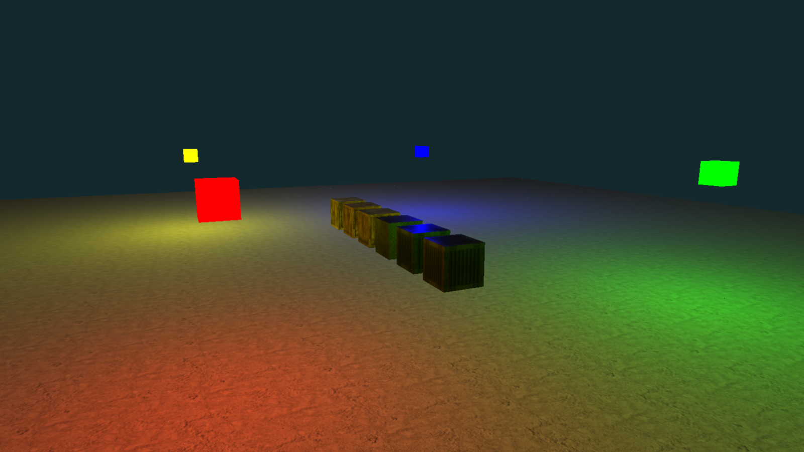
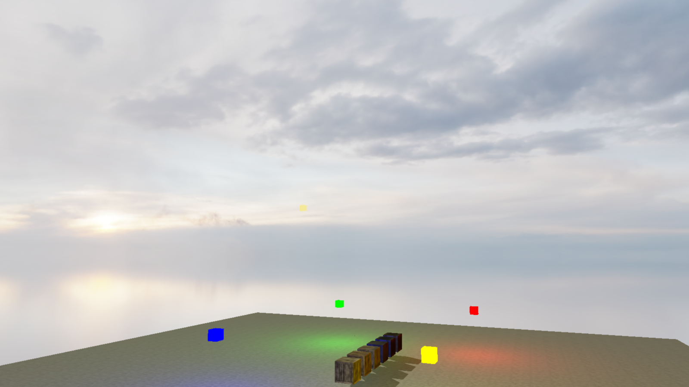
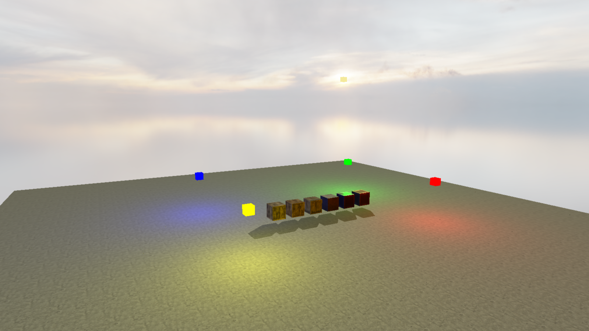

# OpenGL and Vulkan API graphics rendering

_An open exploration of modern 3D rendering in OpenGL and Vulkan._ - Charlie, Nokota Mustang

_**👀 Be an early user on my discord for discussions on OpenGL, Vulkan, 2D/3D Graphics, and game development: <https://discord.gg/Bkhpm8QQ>. Otherwise I'll be around the ModernGL discord too. Also note that I'm still building and adding more demos, so check back every once in a while!**_

Computer graphics is a vast field, and I am interested in learning more about the rendering process and the mathematics behind it. Having a good grasp of realtime graphics, data structures, and algorithms is essential for game development, simulations, and visualizations in 2D or 3D.

`OpenGL` (Open Graphics Library) and `Vulkan` are both industry-standard APIs (Application Programming Interfaces) used for rendering 2D and 3D graphics in applications such as games, virtual reality experiences, and scientific simulations. OpenGL has evolved from an older graphics API called NeHeGL to the current state with versions like OpenGL 4.6, seemingly the last iteration of the API since Vulkan has been standardized.

When comparing OpenGL to Vulkan: OpenGL is a mature, widely adopted API for graphics rendering with a balance of performance and ease of use. And Vulkan is A newer, more performant API designed to provide fine-grained control over hardware resources, optimizing for real-time applications and high-performance graphics.

Small note here on what OpenGL is to DirectX11: OpenGL is cross-platform and DX11 is Microsoft exclusive (PC and Xbox) with a tight integration into the Windows OS. Some differences:

-   OpenGL is state machine based, DX11 is more structured with explicit resource management.
-   OpenGL can have higher overhead from state validation, and DX11 in some cases is more predictable performance wise for Windows.
-   It is said that OpenGL has a steeper learning curve compared to DX11.
-   OpenGL is useful for targeting mobile hardware or older hardware, or open source projects.

On that era of graphics APIs, it is noted that DX11 and OpenGL are more 'high level', than the newer APIs such as Vulkan and DX12. Comparatively Vulkan continues on OpenGL and is cross platform, whereas DX12 is Windows and Xbox exclusive. Some notes:

-   Both being lower level than the previous gen, giving more control over GPU resources, memory, and command buffers.
-   Vulkan being more verbose and required management of memory, synch, and pipelines. DS12 is slightly higher abstraction in comparison.
-   Vulkan has potentially higher performance capabilities due to the control.
-   Vulkan has a strong open source community, DX12 walled in by Microsoft but has access to integrated developer tools.
-   Like OpenGL, Vulkan is useful for mobile hardware, and open source projects; despite DX12 being slightly easier to learn or useful for Windows specific tools or features.

There are several very detailed books about graphics rendering to learn a variety of techniques. What I have discovered is there is no resolved or fixed solution that is the best way to combine multiple techniques to create a coherent and efficient system. When it comes to creating real-time graphics with interactive applications, there is a complex balance between performance and quality, and each _engine_ that is developed has it's own structure, balance, and unique list of bottlenecks.

When exploring a pre-built game engine, the low level rendering process is abstracted away and an assortment of tools and features are provided. Sometimes this carries code-bloat and performance overhead. The bigger the engine, the more features and tools are available, but the more complex and harder to learn it becomes; such in the case of '_Unity_' or '_Unreal Engine_'.

This is the motivation to create your own engines, whether is is for games, visual effects, or other interactive applications. Also to state the obvious, using open source frameworks or engines means you have no licensing or royalty issues to resolve. Despite that, I also wonder how can aspiring computer engineers advance the state of the art if they use pre-built things, instead of learning how things work and implementing their own ideas and advancements.

A final note, the sections in this repository are divided into demo areas like this:

-   OpenGL Python apps.
-   OpenGL C++ apps.
-   Vulkan C++ apps.

Each section contains a small summary of the code eco-system and setup guide for newbies, then a series of subsections with code demonstrations of techniques.

It is accessible to skip to what section you want to read, however It might be better to stick around and work through the whole doc; I leave that up to you and am grateful for your time.

## Python 3.12.10, ModernGL, and Pygame

Python is much simpler to configure with pip, and the ModernGL library makes it easy to get started with OpenGL in Python. ModernGL wraps OpenGL in Python and simplifies the process of creating 3D graphics by grouping API calls into simpler logical routines. Since the base module is compiled in C, the python wrapper provided by ModernGL is still fast for rendering. See the ModernGL documentation for more information: <https://moderngl.readthedocs.io/en/latest/reference/moderngl.html>.

Pygame is a set of Python modules designed for writing video games. It includes computer graphics and sound libraries designed to be used with the Python programming language. This makes a perfect pair of libraries to create 3D graphics in Python.

To install do the following:

1. Download Python: <https://www.python.org/downloads/release/python-3133/> and extract to a directory and add the bin path to your system PATH; I use `c:/python/bin`.

2. In a console enter `pip install -r requirements.txt`, from inside the project directory, to fetch the packages to your global python installation.

3. If you would rather use virtual environments, and not your global environment, then set it up like the following:

    ```bat
    python -m venv venv
    call venv\Scripts\activate
    pip install -r requirements.txt
    ```

    First it creates the virtual environment, activates it in the terminal, and installs the packages from the requirements.txt file to that environment. With this terminal you can run the example without affecting other Python projects on your system.

4. To run an example use `python main.py` from any of the project sub-directories.

Each project is a standalone example of a 3D rendering technique or feature working with Python 3.12.10. Some projects are combined to create a more complex scene. Each project is a self-contained example that can be run independently:

-   Series 1 will follow Blinn-Phong illumination

-   Series 2 will look at full BRDFs including Cook-Torrance and PBR workflows. These are more complex and require a lot of math to understand, but they provide much better results for realistic lighting in games and applications.

-   Series 3 is looking at terrain concepts such as height maps, including geometry shaders for billboards, and visual effects with environment maps.

-   Series 4 is a collection of post-processing and other techniques to enhance the visual fidelity, such as anti-aliasing.

-   Series 5 is environment effects from simple skybox cube-mapping to environment mapping, and volumetric clouds.

-   Series 6 will look at model such as `obj`, and how to import and work with them.

### Series 1 - Simple illumination

Simple illumination models that to start with when learning about 3D and lighting; including shadow-mapping for casting shadows on the scene objects, and multiple light local sources that blend into the scene lighting.

#### py_1.a_blinn-phong - Blinn-Phong

A _bidirectional reflectance distribution function_ (BRDF) is a function of four variables that defines how light from a source is reflected off an opaque surface. As I understand it, _Physically Based Rendering_ (PBR) arrived much later than Phong or the extension from Blinn known as Blinn-Phong, and focuses more on realistic physical properties rather than a more artistic approach

Blinn's model is an approximate of Phong shading, which had an internal issue rendering reflected light more than 90 degrees from the view and the reflection vectors, that made the light look 'cut-off'. The approximation to use the half-way vector corrected this flaw, producing a more realistic illumination model.


_With only global lights on, the shadows are pitch black. The global light, at this angle of the camera, is producing specular reflections on the cubes; the metallic textured cube has a higher specular level than the wooden ones and thus produces more of the effect._

This demo creates a cube mesh from scratch, reuses it as bound to a vertex array object with a vert and frag shader program. I combined multiple rendering techniques in this example:

-   I apply the illumination model described by the _Blinn-Phong_ model from 1975.

-   Global illumination as a directional light, local illumination as point lights and spot lights.

-   Shadow map generation for the shadows cast from the global light.

-   Organized parameters where the lights have strength and color, and the cube objects have a material definition of albedo, diffuse, and specular properties, in addition to texture map.


_With only local point lights on, the effect of those lights are stronger on the scene; however, they have strength attenuation so do not produce a strong effect on the materials without increasing the light strengths._

In some approaches that you see online, the light has a set of properties that include the albedo, diffuse, and specular value. The albedo is the base color of the light, the diffuse is how rough or smooth it is, the specular is how much direct reflection there is. However, I believe this is better to associate the albedo, diffuse, and specular values with the objects and not the lights. So instead I have created the lights to have their own strength and color values.

This arrangement makes it possible to create multiple objects later on with their own properties; which is a good precursor to PBR and the Cook-Torrance brdf. So in my demo look for the attenuation calculation in my `default.frag`, and the resulting radiance value: this will be multiplied into the ambient + diffuse + specular result.

If you change the light strength to 0 or turn the lights off with the hotkeys, you will see the resulting illumination in the scene is pitch black. You can play with the albedo, diffuse, and specular properties of the cubes.

This example adds texture mapping to the object mesh of each cube. This is a trick that creates the illusion of detail where there isn't anything other than flat quads. The texture is a 2D image that is mapped to the surface of the cube using texture coordinates. The texture coordinates are stored in the VBO along with the vertices of the cube.


_Both global illumination and local illumination on._

A shadow map casting system is also added for the global light. A shadow map is a depth buffer that is rendered from the perspective of the light source. The depth buffer is then used to determine if a pixel on the cube is in shadow or not. If the pixel is in shadow, it is darkened; if it is not in shadow, it is illuminated.

A two pass rendering system is used to create shadows in the scene, which is expensive. The first pass renders the scene from the perspective of the light source to create a shadow map. The second pass renders the scene from the perspective of the camera and uses the shadow map to determine if a pixel is in shadow or not. This is a standard approach to simulating shadows: <https://www.opengl-tutorial.org/intermediate-tutorials/tutorial-16-shadow-mapping/>.

I have included several local point light sources in this demo. The point lights can blend into the casted shadows, which is why you see some color on the floor and the cubes when they are in shadow. The flash light can be switched on, which is modelled as a spot-light with the direction set to the camera. A technique to soften the edges is used by providing two angles of the light, as the inner and outer angles. Without added a shadow map for each desired light, it is not possible to add multiple casted shadows.


_With the global and point lights off and the flash light on._

Controls used:

-   `ESC` - Exit
-   `F1` - Toggle Pause time
-   `F3` - Toggle view of wire-frames
-   `F11` - Toggle full screen
-   `WASD` - [Forward, Left, Backward, Right] flying camera movement
-   `Mouse Move` - camera look movement
-   Press `f` to toggle the flash light.
-   Press `F2` to toggle the global light source.
-   Press `F4` to toggle local light sources.
-   Press `F5` to toggle local texture blend.

Reading:

-   LearnOpenGL on lighting: <https://learnopengl.com/Lighting/Colors>.
-   LearnOpenGL on advanced lighting and Blinn-Phong: <https://learnopengl.com/Advanced-Lighting/Advanced-Lighting>.
-   LearnOpenGL on shadow-maps: <https://learnopengl.com/Advanced-Lighting/Shadows/Shadow-Mapping>.
-   On Blinn-Phong <https://interplayoflight.wordpress.com/2013/12/23/an-educational-normalised-blinn-phong-shader/>.

### Series 2 - Advanced BRDF illumination

Complex illumination models that can handle materials of objects.

#### py_2.a_cook-torrance - Cook-Torrance

In 1982, Robert Cook and Kenneth Torrance published a reflectance model that is claimed to more accurately represent the physical reality of light compared to others such as the Blinn-Phong model.


_At first glance the Cook-Torrance model appears a little darker than Blinn-Phong. when we view a metallic surface at a sharp angle facing the light we see a brilliant specular reflection._

For more realism in the model, the computation of the BRDF is more complex. The Cook-Torrance model assumes a surface is composed of tiny micro-facets, each acting as a perfect mirror reflecting light. These micro-facets vary in orientation, producing a range of reflection behaviors from diffuse (rough surfaces) to specular (smooth surfaces).

The model is physically grounded, adhering to principles like energy conservation and reciprocity, and it produces realistic highlights and material appearances under different lighting conditions.



_When the local point lights are viewed without the global light, the reflective properties are clearer to see. With the textures disabled we see the illumination fully._

I continue the format presented in the Blinn-Phong demo, where we have global illumination with cast shadows, a series of local point lights, and a flash light modelled as a spot light from the camera direction.


_Point blank flashlight produces a nice effect from the metallic surfaces._

In summary the Cook-Torrance BRDF combines these components:

-   A diffuse component for scattered, non-directional reflection (e.g., matte surfaces).

-   A specular component for directional, glossy reflections, modeled using micro-facet theory.

Generally, and in this demo, the Cook-Torrance method uses a diffuse Lambertian component and a specular component driven by three terms:

-   Beckmann micro-facet distribution.

-   Fresnel reflectance.

-   Geometry shadowing/masking.

Controls used:

-   `ESC` - Exit
-   `F1` - Toggle Pause time
-   `F3` - Toggle view of wire-frames
-   `F11` - Toggle full screen
-   `WASD` - [Forward, Left, Backward, Right] flying camera movement
-   `Mouse Move` - camera look movement
-   Press `f` to toggle the flash light.
-   Press `F2` to toggle the global light source.
-   Press `F4` to toggle local light sources.
-   Press `F5` to toggle local texture blend.

Reading:

-   LearnOpenGL on Cook-Torrance: <https://learnopengl.com/PBR/Theory>.
-   Cook-Torrance theory: <http://www.codinglabs.net/article_physically_based_rendering_cook_torrance.aspx>.
-   LearnOpenGL on shadow-maps: <https://learnopengl.com/Advanced-Lighting/Shadows/Shadow-Mapping>.

### Series 3 - Terrain rendering

Complex data structures to represent the ground, flora, and everything else to make the outdoors scenes.

#### py_3.a_terrain - Terrain rendering

_**This code is up but I don't have chunking yet! - Charlie.**_

I've combined several techniques to render a ground plane with the 'height map' technique. I have also used 'bill-boards' in the geometry shader to create the flora; and have added the techniques to render a sky and clouds.


_The illumination properties are working nicely, however the grass should have some transparency which I have not modelled into the demo yet. We can also cast shadows onto the billboards, with a similar calculation of the shadow coordinate for each of the vertices in the quad._

The ground plane is created from a height map and displaced in the vertex shader. The normals of the ground plane are calculated in the geometry shader and passed to the fragment shader for lighting calculations.

Grass in complex scenes isn't modelled from a 3D mesh, but rather a series of 2D planes called bill-boards. Starting from the tutorial: <https://vulpinii.github.io/tutorials/grass-modelisation/en/> and <https://developer.nvidia.com/gpugems/gpugems/part-i-natural-effects/chapter-7-rendering-countless-blades-waving-grass>.

The grass is created along each point on the ground plane using a geometry shader and a flow map to simulate wind movement. We can use the shader programs to render more complex objects such as grass. We can simulate wind movement on the grass using a 'flow map', which is a 2D texture that is used to control the movement of the wind. The flow map is used to offset the position of the grass in the geometry shader. Some more info on flow maps: <https://github.com/JaccomoLorenz/godot-flow-map-shader>


_With only local point lights on, I toggle the textures off and we see how the light is playing with the normals of the billboards._

In practice, the height map could be procedurally generated or loaded from an image file. The height map is used to displace the vertices of the ground plane in the vertex shader, and this creates the effect of a 3D ground plane.

For optimization we have to divide the terrain into chunks and manage them just as other objects in the scene.

Controls used:

-   `ESC` - Exit
-   `F1` - Toggle Pause time
-   `F3` - Toggle view of wire-frames
-   `F11` - Toggle full screen
-   `WASD` - [Forward, Left, Backward, Right] flying camera movement
-   `Mouse Move` - camera look movement
-   Press `f` to toggle the flash light.
-   Press `F2` to toggle the global light source.
-   Press `F4` to toggle local light sources.
-   Press `F5` to toggle local texture blend.

Reading:

-   Terrain mesh and height-map: <https://blogs.igalia.com/itoral/2016/10/13/opengl-terrain-renderer-rendering-the-terrain-mesh/>.
-   Grass with wind implementation: <https://vulpinii.github.io/tutorials/grass-modelisation/en/>.
-   GPU gems on grass: <https://developer.nvidia.com/gpugems/gpugems/part-i-natural-effects/chapter-7-rendering-countless-blades-waving-grass>.

### Series 4 - Anti-aliasing

Without anti-aliasing, the straight edges of objects appear jagged because the pixels on the screen are square and the edges are not aligned with the pixels during rasterization. Anti-aliasing smooths out the edges of the cube by blending the colors of the pixels along the edges.

I'll cover AA techniques starting with the basic principle of SSAA is to render the scene at a higher resolution and then down-sample it to the screen resolution.

Other anti-aliasing techniques exist, and they all have trade-offs between quality and performance. The most common anti-aliasing techniques are MSAA (Multi-Sample Anti-Aliasing), FXAA (Fast Approximate Anti-Aliasing), and TAA (Temporal Anti-Aliasing).

MSAA is a cheaper form of SSAA. Instead of going through the process of sampling every pixel, MSAA only comes into play where aliasing could become an issue such as an edge, which saves a lot of computing resources.

FXAA is a post-processing anti-aliasing technique that is applied to the final image. It is a fast and efficient way to smooth out the edges of the cube, but it can produce artifacts and blur the image.

TAA is a temporal anti-aliasing technique that uses information from previous frames to smooth out the edges by blending pixel information. It is considered to produce average results with a lot of blurring, but computationally cheaper than other methods, and therefore became widely used and standardized.

#### py_4.a_ssaa - Super sample anti-aliasing

I added anti-aliasing with a sized up render buffer with 4 samples. This is considered to be 'SSAA' or 'Super-Sample Anti-Aliasing', and usually run slower than other methods but produces the objective 'best quality'.


_No aliasing at all. Perhaps for the expense there is a use for this method, such as for stop motion animations or still renders. Even in real-time a simple demo is very fast._

In MGL this is done by rendering the scene to a render buffer with a higher resolution than the screen, and then down-sampling it to the screen resolution using a **blit** from the render buffer to the screen buffer.

In this demo look for the `AA` class added to the `core` python code. Instanced in the main app, and used in the render function of the scene class.

#### py_4.b-msaa - Multi-sample anti-aliasing

**_Demo being built. - Charlie_**

Reading:

-   LearnOpenGL on anti-aliasing with MSAA: <https://learnopengl.com/Advanced-OpenGL/Anti-Aliasing>.

### Series 5 - Environment rendering

How to add depth and visually represent the environment around the scene.

#### py_5.a_skybox - Simple old-school skybox

The classic skybox is a set of 6 textures arranged as if inside a cube; interestingly the cube-map textures can be converted from a 360 degree parallax image.

We will continue in the next demo with environment mapping to create reflections of the cube-map on our objects.



_The cube-map appears seamless. However, in such a simple demo there is no movement of the background and everything is contained inside on texture._

In this demo look for the `Skybox` class added to the `core` python code. Instanced in the main app, and used in the render function of the scene class.

Reading:

-   LearnOpenGL on cube-maps: <https://learnopengl.com/Advanced-OpenGL/Cubemaps>.

#### py_5.b_env_map - Environment mapping

**_Demo being built. - Charlie_**

Reading:

-   LearnOpenGL on cube-maps second part on environment-mapping : <https://learnopengl.com/Advanced-OpenGL/Cubemaps>.

#### py_5.c_volumetric_clouds - Volumetric clouds

**_Demo being built. - Charlie_**

Reading:

-   Useful resources on volumetric clouds: <https://gist.github.com/pixelsnafu/e3904c49cbd8ff52cb53d95ceda3980e>.

### Series 6 - Model files

How to load model files and make them work in our engine.

#### py_6.a_obj - Wavefront Obj files

Just simple models available free from: <https://free3d.com/3d-models/obj-textures>.


_These particular models are simple with a texture and uv-mapping information._

In this demo look for the `Obj` class added to the `core` python code, and the `PrototypeObj` class used for caching the mesh. Instanced and used in the render function of the scene class.

## OpenGL, C++23, Cmake 4.0, and GLFW

Each project is a standalone example working with C++23 GNU, and CMake 4.
If you know what you are doing and don't need any flavour then skip down to the projects; otherwise if you want tips for Windows development then read on. It took me a decade of ignoring Cmake and then 1 day of trying it out with a good resource video and I would never go back to anything else, I highly recommend using it and learning how to create the `CMakeLists.txt` file.

I have used the modern _FetchContent_ feature from CMake to pull the libraries from their respective repositories where possible in these projects. However, as of now GLAD is provided pre-configured and downloaded. I have setup my OpenGL for the final revisions of OpenGL at core 4.6, therefore these files are added to the `external` directory of the project. I have included notes below on how you can use GLAD to get another version of OpenGL.

The _Khronos OpenGL Specification_ is available as a pdf file:
<https://registry.khronos.org/OpenGL/specs/gl/glspec46.core.pdf>. A list of hardware that supports this is available on the Khronos website: <https://www.khronos.org/conformance/adopters/conformant-products/opengl>.

Here is how you can setup a new project, or continue reading for a description of how I structured mine.

1. Create a project directory, and inside here we do the following:

    - Don't use spaces in the project name for full compatibility, especially if you are using my build batch fils.

    - A `CMakeLists.txt` file at the root of your project.

    - A `src` directory for your code.

    - A `src/main.cpp` file to start your application.

    - An `external` directory for any external libraries you need. Note that I have placed this one level up from the root of each project so that it can be shared across multiple projects. This is the same for the `asset` directory, which you will use to store assets like textures and models. You can place this inside the root if you like, but remember this when you are configuring your build.

2. You will need to install Cmake 4.0.x: <https://cmake.org/download/>, and add the bin folder to your _PATH_, for example I have added `C:\Cmake\bin` to my PATH.

    - Test for the installation by running `cmake --version` in a terminal.

    - If you want to use your older version then fine, but looking at the deprecation warnings and the issues you will have with version policies and so on... I recommend to just update and avoid all of it.

3. You will need to install a compiler, I'm going to point you to 64 bit GNU `gcc` and `g++` compilers from MinGW on Windows:

    - Install `MinGW Portable C, C++, and Fortran Development Kit for x64` from: <https://github.com/skeeto/w64devkit>. I use directory `C:/MinGW`.

    - Add the bin folder of MinGW Portable to your _PATH_ environment variable, such as `C:\MinGW\bin`.

    - Test for the installation by running `gcc --version` or `g++ --version` in a terminal.

    - An additional compiler that replaces `GNU make` is `ninja` developed by _Google_ in 2012. This is said to be significantly faster on larger projects, thankfully you can use both as you wish but each needs their own build directory.

    Get it the release from: <https://github.com/ninja-build/ninja>. If you want to use this install MinGW first and then copy the `ninja.exe` into the `C:\MinGW\bin` directory.

    - Test for the installation by running `ninja --version` in a terminal.

4. If you are not using the OpenGL files that I have included in these projects, setup your own using the GLAD web-service:

    - Go to: <https://gen.glad.sh/> and select GL and the version you want and click _generate_.

    - Download the zip file and place the include and src into your project folder.

    - The `gl.c` file needs to be where your main source file is in the `src` folder. Put the `lib` and `include` directories inside the `external` directory of your project.

    View of the project structure is as follows:

    ```
    parent
    ├──external/
    │   ├── glad/
    │   │   └── gl.h
    │   └── KHR/
    │       └── khrplatform.h
    └── project
        ├──src/
        │    ├── main.cpp
        │    └── gl.c
        └── CMakeLists.txt
    ```

    In more advanced examples I put ogl related helper source code into `opengl_glfw`, with the `gl.c` file as well like this:

    ```
    parent
    ├──external/
    │   ├── glad/
    │   │   └── gl.h
    │   └── KHR/
    │       └── khrplatform.h
    └── project
        ├──src/
        │    ├── main.cpp
        │    ├── app.cpp
        │    └── opengl_glfw/
        |           └── gl.c
        |           └── <engine code>
        └── CMakeLists.txt
    ```

    Again, note that in my examples the `external` directory is another level up for sharing across all projects.

5. To create the build files, you have some options. Although I've used them all, I prefer the first option:

    - **_Recommended_** Use the `.bat` files that I have created in my projects for building, compiling, and running the application:

        So with a terminal run `build development` to create the Cmake build and then `compile development` to compile the executable. If you changed where `external` is you need to modify the `build.bat` script to point where you have it relative to your `CMakeLists.txt`.

        I have added some flags to control what build you are making, so use `debug`, `development`, or `release` as you wish. Debug will enable debug flags in the compiler and code will be slower. Development is for fast runtime but inside your normal dev environment. And release is for when you move the resources to the build to get ready for testing a deployment type environment.

        If you want to use ninja then use `build development ninja` and `compile development ninja`.

        I also added a `run.bat` file that will run the executable from the correct build directory, for the lazy like me.

        _Open the `.bat` files to see the commands used and make use of them in a terminal. Extend and edit these as you need. Rewrite to `.sh` if you desire._

        Remember if you add or rename source files, you will need to build before compiling.

    - **_Or_** A direct command line call for a build with GNU Make and Cmake is like this:

        ```bat
        call cmake ^
        -DCMAKE_BUILD_TYPE:STRING="Development" ^
        -DCMAKE_C_COMPILER:FILEPATH="gcc.exe" ^
        -DCMAKE_CXX_COMPILER:FILEPATH="g++.exe" ^
        -DCMAKE_EXPORT_COMPILE_COMMANDS=1 ^
        -S . ^
        -B ./build ^
        -G "MinGW Makefiles"
        ```

        Replace `-G "MinGW Makefiles"` with `-G Ninja` if you want to use ninja.

        Note that in Windows the `^` character is used for line continuation.

        To compile the executable from the project directory, you can use the following commands in a terminal:

        ```bat
        cd build
        call make
        ```

        or with ninja:

        ```bat
        cd build
        call ninja -j4
        ```

        then call the `app.exe` to run it.

    - **_Or_** use the CMake extension in VS Code to configure the build. Open the `CMakeLists.txt` file, and in the command palette (Ctrl+Shift+P), type "CMake: Select Kit" and press Enter. This will open a list of available kits, including MinGW and MSVC if you have it installed. The settings will build when you open or edit the _CMakeLists_ file from here on out. You can use the debug or run buttons on the bottom bar, which will handle compiling for you.

    - **_Or_** you can use the Cmake gui (in your start programs) to create the build configuration by selecting the project and build directories and the compiler to use for a project that has a `CMakeLists.txt` file. This will setup the build configuration for you. Handy if you don't want GNU or command line. From here you can click generate and exit out. Then you can open the `sln` file in the build directory if you selected MSVC or Visual Studio as your compiler.

6. A quick note on formatting I've used. Since I'm using VSCode and the C++ extension from Microsoft, it is easy to set the formatting style as you like; I prefer the google format which tidies up the braces. If you want to match this then find the setting for `c_Cpp Clang_fallback_format style` and set it like so: `{ BasedOnStyle: Google, IndentWidth: 4, ColumnLimit: 0 }`.

### cpp_ogl_1.a_triangle - Basic window and triangle

This demo is almost raw code from the starter project from GLFW: <https://www.glfw.org/docs/latest/quick_guide.html#quick_example>.

However, I have added the GLM library and FMT library, and a child class, all to fully demonstrate the CMake build process and has everything correctly working.

I have also added code to center the window in the screen. Note that the code is left as a single file with inline shader program code, for simplicity. In the next demo the code will be separated out.


### cpp_ogl_2.a_going_3d - Pyramid and code structure

This demo is my clean and modern implementation of demo 07 from: <https://www.youtube.com/playlist?list=PLPaoO-vpZnumdcb4tZc4x5Q-v7CkrQ6M->. Victor Gordon's youtube and github repo are excellent reworking of the mind-blowing tutorials from LearnOpenGL: <https://learnopengl.com/Getting-started/Textures>.

In this demo we render a texture onto a 3D mesh, we build and write a vertex and fragment shader to render the texture.


## Vulkan, C++23, Cmake 4.0, and GLFW

Each project is a standalone example working with C++23 GNU, and CMake 4.
If you know what you are doing and don't need any flavour then skip down to the projects; otherwise if you want tips for Windows development then read on.

I have used the modern FetchContent feature from CMake to pull the libraries from their respective repositories where possible in these projects, GLFW, GLM, etc. However Vulkan itself is included manually, similar to the Opengl examples.

The _Khronos OpenGL Specification_ is available on the web:
<https://registry.khronos.org/vulkan/specs/latest/html/vkspec.html>. A list of hardware that supports this is available online: <https://vulkan.gpuinfo.org/>.

A great tutorial series for C++ and Vulkan is Brendan Galea's tutorial: <https://www.youtube.com/playlist?list=PL8327DO66nu9qYVKLDmdLW_84-yE4auCR>. I have learned a lot from his works and I highly recommend checking out his channel.

Before we get to the projects in this repository, here is how I have set up my projects:

1.  Create a project directory, and inside here we do the following:

    -   Don't use spaces in the project name for full compatibility, especially if you are using my build batch files.

    -   A `CMakeLists.txt` file at the root of your project.

    -   A `src` directory for your code.

    -   A `src/main.cpp` file to start your application.

    -   An `external` directory for any external libraries you need. Note that I have placed this one level up from the root of each project so that it can be shared across multiple projects. This is the same for the `asset` directory, which you will use to store assets like textures and models. You can place this inside the root if you like, but remember this when you are configuring your build.

2.  You will need to install Cmake 4.0.x: <https://cmake.org/download/>, and add the bin folder to your _PATH_, for example I have added `C:\Cmake\bin` to my PATH.

    -   Test for the installation by running `cmake --version` in a terminal.

    -   If you want to use your older version then fine, but looking at the deprecation warnings and the issues you will have with version policies and so on... I recommend to just update and avoid all of it.

3.  You will need to install a compiler, I'm going to point you to 64 bit `gcc` and `g++` compilers from MinGW on Windows:

    -   Install `MinGW Portable C, C++, and Fortran Development Kit for x64` from: <https://github.com/skeeto/w64devkit>. I use directory `C:/MinGW`.

    -   Add the bin folder of MinGW Portable to your _PATH_ environment variable, such as `C:\MinGW\bin`.

    -   Test for the installation by running `gcc --version` or `g++ --version` in a terminal.

    -   An additional compiler that replaces `GNU make` is `ninja` developed by _Google_ in 2012. This is said to be significantly faster on larger projects, thankfully you can use both as you with but each needs their own build directory.

    Get it the release from: <https://github.com/ninja-build/ninja>. If you want to use this install MinGW first and then copy the `ninja.exe` into the `C:\MinGW\bin` directory.

    -   Test for the installation by running `ninja --version` in a terminal.

4.  Download and prepare the Vulkan library manually:

    -   Vulkan SDK: <https://vulkan.lunarg.com/sdk/home>.
        -   Install the Vulkan SDK.
        -   In start menu look for VulkanCube and run it to check if Vulkan is installed correctly.
        -   Browse to installation directory and copy the `include` and `lib` folders to a subfolder such as `external/vulkan`.
        -   The installer added _VK_SDK_PATH_ and _VULKAN_SDK_ to your environment. As well as `C:/vulkan/Bin` to your _PATH_.

    The external files directory should have a structure as follows:

    ```
    parent
    ├──external/
    │   └── vulkan/
    │       ├── Include/
    │       │       └── vulkan/
    │       │       └── glm/
    │       │       └── sdl2/
    │       │       └── etc
    │       └── Lib/
    │           └── vulkan-1.lib
    │           └── etc
    └── project
        ├──src/
        │    ├── main.cpp
        │    ├── app.cpp
        │    └── vulkan_glfw/
        │           └── <engine code>
        └── CMakeLists.txt
    ```

    Note that I have placed my `external` directory one level above the project root, this is reflected in the path inside the `CMakeLists.txt` files in each project.

5.  Additional support for compiling shader programs

    -   Create a file called `shader_compile.bat`. Open this file and paste the code:

        ```bat
        @echo off

        REM Look for any .vert .geom or .frag file and compile them to SPIR-V
        for /R "./shaders" %%f in (*.vert) do (
            echo  - %%~nf.vert
            call glslc.exe %%f -o "./shaders/compiled/%%~nf.vert.spv"
        )
        for /R "./shaders" %%f in (*.geom) do (
            echo  - %%~nf.geom
            call glslc.exe %%f -o "./shaders/compiled/%%~nf.geom.spv"
        )
        for /R "./shaders" %%f in (*.frag) do (
            echo  - %%~nf.frag
            call glslc.exe %%f -o "./shaders/compiled/%%~nf.frag.spv"
        )
        ```

    -   If you run this `.bat` file, it will compile all `.vert`, `.geom`, and `.frag` files to `.spv` files.

    -   I write the compiled shader files to the `shaders/compiled` directory, to make it easier to separate the source from the compiled files when coding.

    -   Stating the obvious here but you can add a `call shader_compile` to your build, compile, or run scripts to perform this automatically.

6.  Building a one file test program to create a window:

    -   Create a new file `main.cpp` in the project:

        ```cpp
        #define GLFW_INCLUDE_VULKAN
        #include <GLFW/glfw3.h>
        //
        #define GLM_FORCE_RADIANS
        #define GLM_FORCE_DEPTH_ZERO_TO_ONE
        #include <glm/vec4.hpp>
        #include <glm/mat4x4.hpp>

        #include <iostream>

        void testVulcan() {
            glfwInit();
            glfwWindowHint(GLFW_CLIENT_API, GLFW_NO_API);
            GLFWwindow* window = glfwCreateWindow(1600, 900, "Vulkan window", nullptr, nullptr);
            uint32_t extensionCount = 0;
            vkEnumerateInstanceExtensionProperties(nullptr, &extensionCount, nullptr);
            glm::mat4 matrix;
            glm::vec4 vec;
            auto test = matrix * vec;
            while (!glfwWindowShouldClose(window)) {
                glfwPollEvents();
            }
            glfwDestroyWindow(window);
            glfwTerminate();
        }

        int main() {
            try {
                testVulcan();
            }
            catch (const std::exception& e) {
                std::cerr << e.what() << '\n';
                return EXIT_FAILURE;
            }
            return EXIT_SUCCESS;
        }
        ```

7.  To create the build files:

    -   Use the `.bat` files that I have included for building, compiling, and running.

        So with a terminal run `build development` to create the Cmake build and then `compile development` to compile the executable. If you changed where `external` is you need to modify the `build.bat` script to point where you have it relative to your `CMakeLists.txt`.

        I have added some flags to control what build you are making, so use `debug`, `development`, or `release` as you wish. Debug will enable debug flags in the compiler and code will be slower. Development is for fast runtime but inside your normal dev environment. And release is for when you move the resources to the build to get ready for testing a deployment type environment.

        If you want to use ninja then use `build development ninja` and `compile development ninja`.

        I also added a `run.bat` file that will run the executable from the correct build directory.

        Open the `.bat` files to see the commands used and make use of them in a terminal. Extend and edit these as you need. Rewrite to `.sh` if you desire.

        Remember if you add or rename source files, you will need to build before compiling.

    -   For alternate building and compiling please see the OpenGL C++ section.

8.  A quick note on formatting I've used. Since I'm using VSCode and the C++ extension from Microsoft, it is easy to set the formatting style as you like; I prefer the google format which tidies up the braces. If you want to match this then find the setting for `c_Cpp Clang_fallback_format style` and set it like so: `{ BasedOnStyle: Google, IndentWidth: 4, ColumnLimit: 0 }`.

### cpp_vlk_1.a_triangle - Triangle rendered with vulkan

This example is a simple triangle rendered with Vulkan using a vertex and fragment shader.


### cpp_vlk_2.a_blinn_phong - Blinn-Phong shading with multiple dynamic lights

This project is my implementation from Brendan Galea's tutorials.


There are some differences to how this is set up, noted as follows:

-   I preferred to place rendering, glfw, and vulkan classes inside a sub-directory called 'vulkan_glfw', as with the previous demo.

-   In terms of coding style I have not used namespace definition regions, I found it hard to read -- and I have opted to use namespace single identifiers where possible.

-   As you can see in the build.bat file (if you use it), I have included a rudimentary release part of the script that will copy assets to where the `.exe` is built. This is handy for quick testing of a release with compile time macros, in particular in this demo note the preprocessor macros used to control paths, such as the shaders:

    In `point_light.cpp` and `simple_render.cpp`.:

    ```c++
    string root_path = "../../../shaders/compiled/";
    #ifdef COMPILE_RELEASE
        root_path = "shaders/";
    #endif
    ```

    And for the model files in `model.cpp`:

    ```c++
    string root_path = "../../../../";
    #ifdef COMPILE_RELEASE
        root_path = "";
    #endif
    ```

    See `release.txt` for the _**from=to**_ path pairs that I'm asking the script to copy. This is just a quick thing I came up with to go with my batch scripts, since I am building to individual folders depending on what what used to compile, and I would probably create scripts in something more robust such as python.
